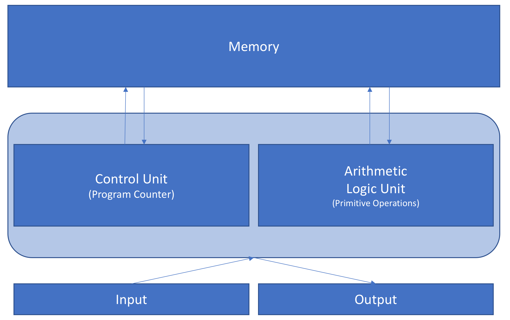

# 프로그래밍 이해
## KB Card Digital Transformation

---
<!--
page_number: true
$size: A4
footer : KB Card x Fastcampus, Wooyoung Choi, 2019
-->
## Introduce

### 최우영
- Co-founder, Developer at 
- Solution Architect, Web Developer, Instructor
- python web crawling bootcamp(gilbut, 2019 expected)
- Skills: Python, Golang, Julia, Node.js, Google tag manager ...

#### github: https://github.com/ulgoon/
#### email: me@ulgoon.com

---
## Notice
- 수업의 난이도는 문과생도 이해할 수 있을 정도로 쉽게 진행할 예정입니다.
- 50분 수업, 10분 휴식

- https://github.com/ulgoon/kbcard-digital-transformation 에서 슬라이드와 자료를 다운로드 받을 수 있습니다.
- 수업은 강의형으로 진행됩니다.

---
## Index

- 컴퓨터란? 프로그래밍이란?
- 프로그래밍 입문을 위해 필요한 사전지식
	- Computational Thinking
	- 알고리즘과 의사코드(pseudo code)
	- 프로그래밍 언어
- 알쓸신컴
- 프론트엔드와 백엔드
- 프로그래밍 용어와 트렌드 알아보기
	- 데이터베이스
	- API
	- 클라우드 컴퓨팅


---
### 컴퓨터란? 프로그래밍이란?

---
### Computer

- Compute + er: 연산을 수행하는 기계,장치 또는 사람

---
### Computer vs Calculator
<div align="center">


</div>

- `Stored Program` computer -> Computer
	- Stores and Executes intructions
- `Fixed Program` computer -> Calculator
	- just calculate 

---
### Basic Computer Architecture


---
### Computer Programming or Coding
- 하나 이상의 관련된 추상 알고리즘을 특정한 프로그래밍 언어를 이용해 구체적인 컴퓨터 프로그램으로 구현하는 기술

---
### Coder, Programmer, Developer

- Coder: 문제를 해결하고 코드로 구현(Implementation)
- Programmer: 알고리즘을 이해하고 이를 활용하여 구현
- Developer: 다양한 시스템과 언어에 대해 이를 설계하고 구현


---
### 프로그래밍 입문을 위해 필요한 사전지식

---
### Computational Thinking
> 정답이 정해지지 않은 문제에 대한 해답을 일반화하는 과정

컴퓨터와 개발자의 동작 및 사고체계를 이해하는데 매우 도움이 됩니다!

---
<iframe width="960" height="540" src="https://www.youtube.com/embed/cDA3_5982h8" frameborder="0" allow="autoplay; encrypted-media" allowfullscreen></iframe>

---
### Process of Computational Thinking
1) 문제 조직화(추상화) - Problem Formulation (abstraction)
2) 솔루션 구현(자동화) - Solution Expression (automation)
3) 솔루션 실행 및 평가(분석) - Solution Execution & Evaluation (analyses)

---
### Computational Thinking by example
- 문제인지: **배가고프다!**
- 문제조직화
	- 문제분해
		- 얼마나 배가고픈가
			- 간단히 떼운다
			- 정식을 먹는다
		- 나는 지금 어디인가?
			- 집: 밥솥의 밥 또는 라면을 먹는다
			- 여의도
				- 편의점: 삼각김밥 ~ 도시락
				- 식당: 패스트푸드 ~ 점심뷔페

---
### Computational Thinking by example
- 패턴인지
	- <span style="font-size:24px;">`아! 배가 어느정도 고프면 어디서 뭔가를 먹음으로써 Hunger가 False가 되는구나` </span>
- 일반화/추상화
	- 추상화(간결하고 명확하게 단순화, 일반화, 개념화)
		- <span style="font-size:24px;">`배가 고프면` `{{얼마나}}`배가 고플때, `{{어디}}`에서 `{{어떻게}}`해결함</span>
	- 알고리즘

---


---
### Algorithms and pseudo code

---
### Algorithms
- 어떤 문제를 해결하기 위해 기술해 놓은 명확한 절차, 명령집합
- 페르시아 수학자 알-콰리즈미(الخوارزمي) 에서 유래
- 큐브 해법, 미로
- 정렬, 탐색, 백트래킹, 다이나믹 프로그래밍, 그래프 등등
- 시간복잡도와 공간복잡도로 알고리즘을 평가

---
### pseudo code
- 알고리즘을 표현하는 방법
- 자연어로 만든 문장을 프로그래밍 언어 형식으로 배치
- 프로그램 설계의 밑그림 역할
- 주석 역할을 수행할 수 있음
- 정해진 문법은 정해지지 않았으나 표현될 언어의 스타일에 맞춰 작성되는 것이 편함

---
#### I'm still hungry

1. hunger가 true가 됨
2. 돈이 없고, 현재위치가 집일때,
	1. 밥솥에 밥이 있다면, 해결한다.
	2. 굶는다.
3. 돈이 있고, 현재위치가 밖일때,
	1. 현금이 10만원 초과라면, 레스토랑을 간다.
	2. 현금이 10만원 이하라면, 편의점을 간다.

---
### Fizzbuzz
- 1 부터 n 까지 반복하면서
	- 3의 배수는 "fizz" 
	- 5의 배수는 "buzz" 
	- 15의 배수는 "fizzbuzz" 
	- 나머지는 숫자를 출력

---
### fizzbuzz
```
1. get integer from user ==> num, i == 1
2. WHILE i is less than or equal to num
3. if i is divisible by 3, print "fizz"
4. if i is divisible by 5, print "buzz"
5. if i is divisible by 15, print "fizzbuzz"
6. else, print i
```

---
### 프로그래밍 언어
- 소프트웨어를 작동시키기 위한 형식언어
- 표현방법, 작동방법, 자료 저장 방법 등에 따라 분류

---
### 저급언어 vs 고급언어
- 급 != Quality, 급 == Level
- 저급언어: 기계어, 어셈블리어
	- 실행속도가 빠르지만 이해하기 어려움
- 고급언어: 나머지
	- 이해하기 쉽지만 실행속도가 느림

---
### 컴파일 언어 vs 인터프리터
- 컴파일 언어
	- 컴파일러를 통해 소스코드를 기계어로 변환
	- Cobol, Fortran, C, C++, ObjC, C#, Basic, Go, ..
- 인터프리터
	- 사용자가 작성한 소스코드를 직접 실행
	- Python, java, ruby, javaScript, php, ..

---
## 정적 타이핑 vs 동적 타이핑
- 정적타이핑: 값의 형태를 미리 지정
	- C, C++, C#, java, ..
	- 실행 전 Compile Error가 발생
- 동적타이핑: 실행 당시 값의 형태를 지정
	- javaScript, ruby, python, ..
	- 실행 도중 Type Error가 발생

---
## 알쓸신컴
- PC, Mobile Device
- Internet, WWW
- Block Chain

---
### PC(Personal Computer)

---
### PC
- IBM Personal Computer 에서 유래
- 1970년대, microprocessor의 개발로 폭발적 성장(Altair 8800, Apple1 based on Intel 8080)
- Super Computer > **Mainframe Computer** > ~~Workstation~~ > Personal Computer

- Mainframe -> Cloud Computing

---
### Mobile Device(Smart Phone)
- 모바일 컴퓨팅을 지원하는 기기
- Requirements: mobile OS, Internet, multimedia, call, text msg
- PDA(1990s - Nokia 2110, Palm)
- BlackBerry(2002) - Business uses
- iPhone(2007) - App Store
- **Next?**

---
## Internet, WWW

---
### Data?
- 컴퓨터가 처리할 수 있는 문자, 숫자, 소리, 그림 따위의 형태로 된 정보.
- Latin "Datum"의 복수형 "Data"에서 유래

---
### Internet
- Internet(`International Network`): TCP/IP를 활용하여 정보를 주고 받는 통신 네트워크(www)

---
### WWW(World Wide Web)
- URL로 구분될 수 있는 문서와 리소스들이 하이퍼링크를 통해 연결되는 정보공간
- 1989년, Tim Berners-Lee가 CERN의 내부 문서 공유 시스템을 개발

---
## Block Chain


---
### Block Chain
- 분산 컴퓨팅 기술 기반의 데이터 위변조 방지 기술
- 데이터들이 체인형태로 연결된 블록에 저장되어 누구나 열람 가능

---
### Bitcoin
- 재래 통화의 신뢰문제를 해결하기 위해 만든 시스템
- 2008년 10월 [논문](https://bitcoin.org/bitcoin.pdf) 공개
- 2009년 1월 3일 제네시스 블록 생성
- 신뢰(비잔틴 장군의 문제) 해결을 위해 블록체인과 작업증명(Proof of Work)로 해결
- 블록생성에 기여하는 사용자는 bitcoin을 보상으로 제공(채굴)

---
### Ethereum
- 2015년 창안한 퍼블릭 블록체인 플랫폼, 또는 그 통화
- Blockchain을 기반으로 계약서 SNS 등 어플리케이션의 투명한 운영을 가능케 함 -> ERC
- Solidity 언어로 이더리움 기반의 어플리케이션을 작성
- PoW(작업증명) -> PoS(Proof of Stake, 지분증명) 전환

---
### [libra by facebook](https://libra.org/en-US/white-paper/)
- facebook이 개발한 블록체인 플랫폼
- facebook messenger와 whatsapp 에서 P2P 전송 및 소매 결제 수단으로 활용
- Visa, MasterCard, Uber와 파트너십

---
### Frontend? Backend?


---
### Frontend


---
### Backend


---
### Web architecture


---
### 웹, 앱 개발에 쓰이는 언어와 도구들

---
### Frontend(Web)
- HTML/CSS
- javaScript(Web Assembly, dart)
- jQuery
- AJAX
- Frontend Frameworks
	- Angular
	- React.js
	- vue.js
- gulp, webpack, babel, .. 


---
```html
<!doctype html>
<html>
  <!-- This is HTML -->
  <head>
    <title>This is HTML</title>
  </head>
  <body>
    <h1 id="article-title">HTML</h1>
    <p class="plain-text">HyperText Markup Language</p>
  </body>
</html>
```


---
### HTML
- HyperText Markup Language
- 웹사이트의 구조를 정의하기 위해 탄생
- HTML 5.2가 웹 표준

---


---
### 웹은 표준과 접근성이 매우 중요합니다!
- 위를 준수하지 않으면 검색 점수에서 불리해집니다.
- 접근성을 높여야 보다 다양한 사용자가 상품구매까지 도달할 수 있습니다.
- 현재 웹 표준은 5.2!!

---
```css
/* This is CSS */
body {
  margin: 0;
  padding: 0;
}

#article-title {
  color: #dd0044;
  font-family: 'Human-Gulim', sans-serif;
}

.plain-text {
  line-height: 1.4em;
  font-size: 1.1em;
}
```

---
## CSS
- Cascading Style Sheet
- 웹 문서(HTML)의 스타일을 간단하게... 꾸밀 수 있도록 도와주는 스타일 문서
- 현재 CSS3 릴리즈

---
## So, CSS is ..


---
## So, CSS is ..


---
```javascript
// This is javaScript
var languageName = "javaScript";

for (i=0;i<11;i++){
  if (languageName==="javaScript"){
    console.log("This is javaScript");
  }
}
```

---
### javaScript란?
- 객체 기반의 스크립트 프로그래밍 언어
- 웹페이지의 동적인 제어 목적
- Netscape의 Brendan Eich가 모카(Mocha)를 개발
- LiveScript -> javaScript로 개명

---
### javaScript is like ..


---
### Static Web site - 1
<div id="dynamic-btn1" style="width:200px; height:200px; background:red;"></div>

---
### Static Web site - 2
<div id="dynamic-btn2" style="width:200px; height:200px; background:green;"></div>

---
### Static Web site - 3
<div id="dynamic-btn3" style="width:200px; height:200px; background:blue;"></div>


---
### Dynamic Web site
<div id="dynamic-btn" style="width:200px; height:200px; background:black;"></div>
<button type="button" onclick="document.getElementById('dynamic-btn').style.background='red'" style="font-size:20px;">Red</button>
<button type="button" onclick="document.getElementById('dynamic-btn').style.background='green'" style="font-size:20px;">Green</button>
<button type="button" onclick="document.getElementById('dynamic-btn').style.background='blue'" style="font-size:20px;">Blue</button>


---
### Java != javaScript

|Java|vs|javaScript|
|:--:|:--:|:--:|
|Sun|개발|Brendan Eich|
|JVM|구동방식|Script Engine(Browser)|
|C|영향|C|
|인도|Like|인도네시아|

---
### Frontend(App)
- swift, objC(iOS)
- kotlin, java(Android)
- Lots of Tools..(ex.retrofit, rxjava, cocoa touch)

---
### Backend
- Depend on Language..
```javaScript
{
    java:spring,
    python:[django, flask],
    c,c++: asp.net,
    ruby: ruby on rails,
    php: Laravel,
    javaScript: node.js,
    Golang: itself,
}
```
- Database
- Cloud(AWS, google cloud, MS Azure)

---
### Tools for Developer
- git
- travisCI, jenkins
- slack, trello

---
## Database
- 체계화된 데이터의 모임
- 여러 응용 시스템들의 통합된 정보들을 저장하여 운영할 수 있는 공용 데이터들의 묶음

---
## DB?? DBMS??

DBMS(DataBase Management System)
- 데이터의 모임인 Database를 만들고, 저장, 관리 할 수 있는 기능을 제공하는 응용프로그램
- Oracle, Mysql, MariaDB, DB2, MS SQL Server, ..

---
## Characteristics
- 데이터의 무결성 유지(정확성,일관성)
- 데이터의 중복 최소화
- 보안(추상화, 접근권한)
- 성능 향상
- 프로그램 수정과 유지 보수 용이

---
## Differences between DataBase & File System
자기기술성

File System
- .hwp -> 한글
- .doc -> Microsoft Word
- .xls -> Microsoft Excel

DB
- Only SQL(RDBMS)

---
## SQL(Structured Query Language)

데이터 관리를 위해 설계된 특수 목적의 프로그래밍 언어


---
## RDBMS vs NoSQL
|구분|RDBMS|NoSQL|
|:--:|:--:|:--:|
|형태|Table|Key-value, Document, Column|
|데이터|정형 데이터|비정형 데이터|
|성능|대용량 처리시 저하|잦은 수정시 저하|
|스키마|고정|Schemeless|
|장점|안정적|확장성, 높은 성능|
|유명|Mysql, MariaDB, PostgreSQL|MongoDB, CouchDB, Redis, Cassandra |

---
## RDBMS
[PostgreSQL Docs](https://www.postgresql.org/docs/9.1/static/ddl-basics.html)
[MariaDB Docs](https://mariadb.com/kb/en/mariadb/basic-sql-statements/)

|name| age|
|:--:|:--:|
|John|  17|
|Mary|  21|

---
## 
`Table` == Relation
|`Primary Key`|`Attribute1`|Attr2|Attr3|Attr4|
|:--:|:--:|:--:|:--:|:--:|
|`Tuple1`|||||
|Tuple2|||||
|Tuple3|||||
|Tuple4|||||

---
## NoSQL
[MongoDB Docs](https://docs.mongodb.com/manual/core/document/)
```python
nosql = 
[
	{
		name:John, 
		age:17
	},
	{
		name:Mary, 
		age:21
	},

	...
]
```

---
## Schema
- Database의 구조와 제약조건에 대한 전반적인 명세 기술
- Database의 Blueprint
- 외부(서브)스키마, 개념스키마, 내부스키마로 구성

---
## API란?

---
## API
> Application Program Interface
- 응용프로그램에서 사용할 수 있도록 운영체제나 프로그래밍 언어가 제공하는 기능을 제어할 수 있게 만든 인터페이스
- [Windows API](https://msdn.microsoft.com/en-us/library/windows/desktop/ff818516(v=vs.85).aspx)
- [python/C API](https://docs.python.org/3.6/c-api/index.html)

---
## 예를 들면 ..

- 한글 프로그램에서 마우스 이동 후 메뉴 선택하는 절차
	- 마우스 이동 신호 발생 -> OS가 감지 후 좌표값 계산 후 모니터에 그려냄 -> 마우스 클릭 신호 발생 -> OS가 감지 후 해당 좌표에 클릭이 발생했음을 한글 프로그램에 알려줌 -> 한글프로그램은 좌표 계산 후 메뉴를 클릭했을 때의 애니메이션을 실행

---
## Web API
> 웹서버 혹은 웹브라우저를 위한 API


---
## Open API(Public API), Private API

---
### Open API(Public API)
- 서비스 외부에서 제어할 수 있도록 인터페이스를 제공하는 것
- idea from open-source - create it, open it up to users, then let them run with it.
- 브랜드 확장과 홍보에 도움
- 메인 백엔드 시스템과 반응하는 다른 flow 설계
ex) 공공데이터 포털 - https://www.data.go.kr/
카카오 OPEN API - https://developers.kakao.com/

---
### Private API
- 서비스 내부에서 제어 가능한 인터페이스를 제공하는 것
- 내부 서비스 개발 경험 향상을 위해 적용
- Micro Service 와 같은 아키텍쳐 설계시 필수로 적용
- 운영비용 감소 효과

---
## REST API
`RE`presentational `S`tate `T`ransfer 
`A`pplication `P`rogramming `I`nterface

`Resource` - URI
`Verb` - HTTP method
`Representations` - 표현

---
## So, REST is
> HTTP URI + HTTP method

[Yahoo Finance](https://finance.yahoo.com/)
[json api](http://jsonapi.org/)

---
## [Roy Fielding](http://roy.gbiv.com/)


- 2000년 UC Irvine의 박사 학위 논문 "Architectural Styles and the Design of Network-based Software Architectures" 발표

---
## Characteristics of REST
- 범용성(HTTP가 가능하면 OK)
- 리소스 중심 API 명세(URI를 읽는 것으로 이해 가능)
- Stateless(클라이언트의 상태를 신경쓰지 않음)

---
## pros and cons of REST
pros: 
- 스펙없이 기존의 HTTP를 이용해 요청을 처리할 수 있다.

cons: 
- 사용할 수 있는 메소드가 4개다
- 표준이 없다

---
### Before REST


---


---
## CRUD

### Create
### Read
### Update
### Delete

---
## 예를 들면..

- GET /users/12341234 -> 12341234라는 유저의 정보를 주세요
- POST /users/12341234 -> 12341234라는 유저로 회원가입합니다.
- PUT /users/12341234 -> 12341234유저의 개인정보를 수정합니다
- DELETE /users/12341234 -> 12341234 회원이 탈퇴합니다.

---
## URI 라는 리소스에 대해 HTTP method로 하고 싶은 일을 요청하면 끝!

---
## REST API를 활용하면, HTTP 통신이 가능한 환경(웹,앱 등)이면 언제든지 사용가능!

---
#### REST API 설계시 주의할 점

- 버전관리 https://api.foo.com/v1/bar
- 명사형 사용 https://foo.com/showid/ --> https://foo.com/user/
- 반응형 https://foo.com/m/user/, https://m.foo.com/user/ (x)
- 언어코드 https://foo.com/kr/, https://kr.foo.com/ (x)
- 응답상태 코드 (200, 400, 500)

---
## HTTP Response code

200, 201 - Success
400, 404 - Not found
500 - Server error

[more info..](https://www.w3.org/Protocols/rfc2616/rfc2616-sec10.html)


---
## Cloud Computing


---
## Cloud Computing
- 인터넷에 연결된 다른 컴퓨터로 연산을 하는 기술
- 접근성, 주문형 서비스 제공으로 경제적이고 효율적인 컴퓨팅 서비스 제공
- Amazon Web Service(Amazon), Google Cloud Platform(Google), Microsoft Azure(Microsoft), ..
- Virtual Machine, Cloud Storage, Database, Docker Engine 등 다양한 서비스 제공

---
### IaaS, PaaS, SaaS


---
### SaaS
- 소프트웨어의 가상화
- Dropbox, Google Apps, Slack, ..

### PaaS
- 제공 플랫폼의 가상화
- Heroku, Google App Engine, Microsoft Azure, ..

### IaaS
- 물리적 자원의 가상화
- Google Compute Engine, AWS EC2, Microsoft Azure, ..


<link href="https://fonts.googleapis.com/css?family=Nanum+Gothic:400,800" rel="stylesheet">
<link rel='stylesheet' href='//cdn.jsdelivr.net/npm/hack-font@3.3.0/build/web/hack-subset.css'>

<style>
h1,h2,h3,h4,h5,h6,
p,li, dd {
font-family: 'Nanum Gothic', Gothic;
}
span, pre {
font-family: Hack, monospace;
}
</style>